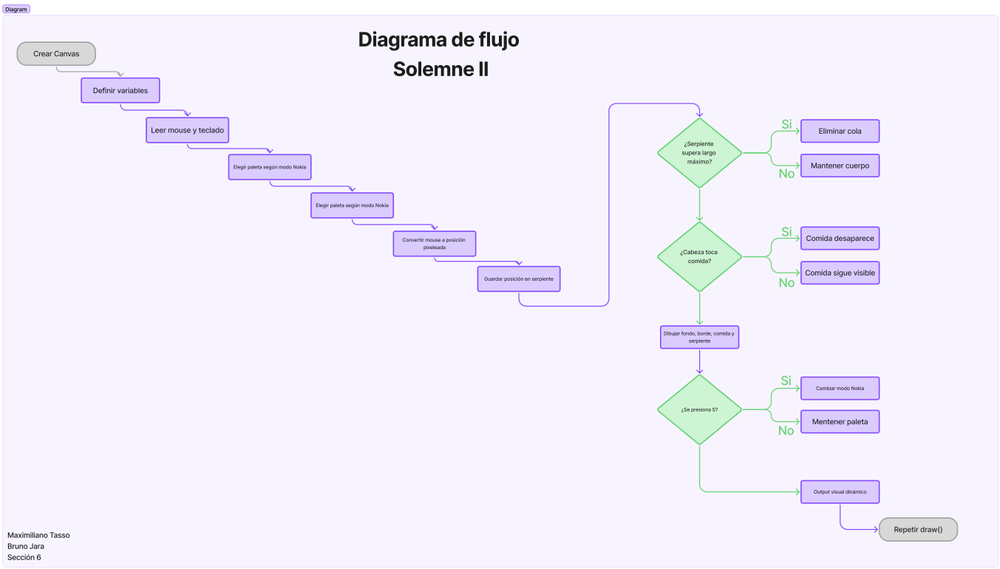
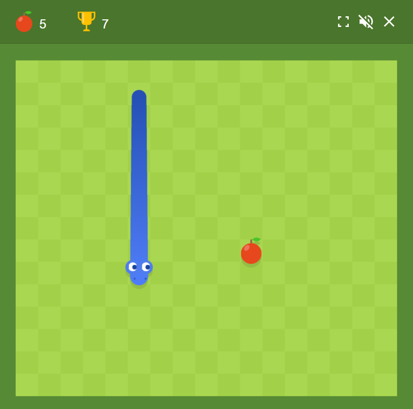
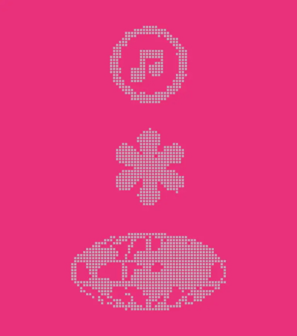
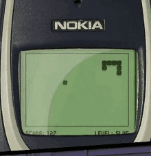
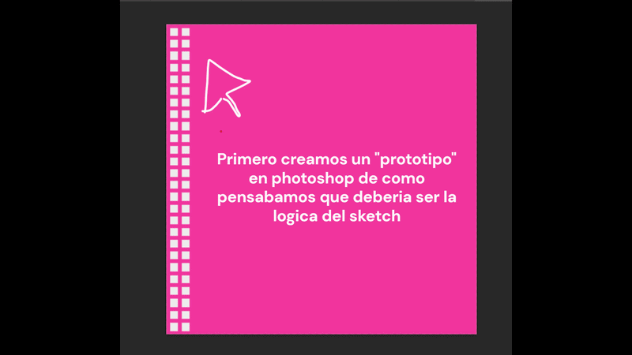
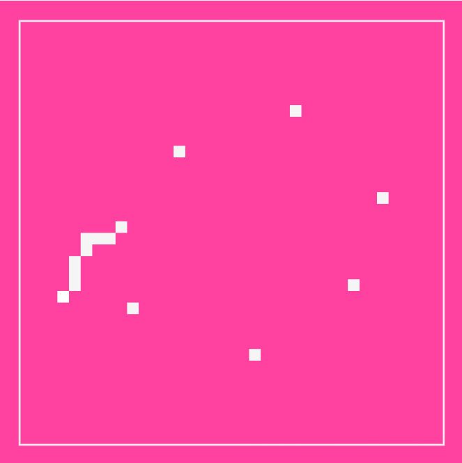

# Pensamiento-computacional-Solemne2

## 1. Información del proyecto

**Nombre del proyecto:**  
Snake Pixel System

**Autores:**  
Maximiliano Tasso
Bruno Jara
---

## 2. Descripción objetiva

Este proyecto consiste en un sistema visual interactivo programado en p5.js. La propuesta toma como base una serpiente formada por módulos cuadrados que sigue el movimiento del mouse dentro del canvas, tomando el lenguaje visual de la serpiente.
En pantalla se ve una composición visual de 800 x 800 píxeles, con un fondo de color, un borde que simula una pantalla y una serpiente construida a partir de cubos. La serpiente deja un rastro siguiendo la posición del mouse.

Los elementos visuales principales son:

- Cubos que forman el cuerpo de la serpiente.
- Una cabeza diferenciada por color.
- Cubos fijos que funcionan como comida.
- Un borde que enmarca la composición como si fuera una pantalla.
- Dos paletas de color: una paleta rosada contemporánea y una paleta verde inspirada en Nokia.

El sistema utiliza como input principal la posición del mouse. También utiliza la tecla **S**, que permite cambiar entre la paleta rosada y la paleta inspirada en la pantalla clásica de Nokia.

Como output, el sistema genera una serpiente visual que se mueve en tiempo real, cambia de posición, deja un rastro modular y elimina cubos de comida cuando pasa sobre ellos.

---

## 3. Descripción conceptual

La idea central del proyecto es reinterpretar la lógica visual del juego **Snake de Nokia** a través de un sistema interactivo simple. En lugar de recrear el juego de manera literal, el proyecto traduce algunos de sus elementos principales: el cuerpo modular, el movimiento pixelado, la comida y la estética de pantalla antigua.

El proyecto dialoga con el **diseño de videojuegos retro**, especialmente con la visualidad de los juegos móviles antiguos. También se relaciona con el **pixel art**, ya que todos los elementos están construidos a partir de cuadrados como unidad mínima.

### Referentes visuales, teóricos o históricos

**Snake de Nokia:**  
Principal referente del proyecto. Se toma su lógica de serpiente modular, movimiento simple, comida y estética de pantalla monocromática.

**Pantallas LCD antiguas:**  
Se utilizan como referencia para la paleta Nokia, compuesta por verdes apagados y tonos oscuros.

**Pixel art:**  
Se usa como principio visual para construir la imagen a partir de unidades cuadradas simples.

**Diseño de videojuegos retro:**  
El sistema toma elementos de interacción básica, respuesta inmediata y reglas simples propias de videojuegos antiguos, no hay movimientos dinamicos, suaves o diagonales, tiene que sentirse más rigído.

### Principio de diseño explorado

El principio de diseño explorado es la **modularidad**. La serpiente está construida a partir de una repetición de cubos, donde cada módulo forma parte de un sistema mayor.
También se explora la **interactividad**, ya que el usuario modifica directamente el comportamiento visual del sistema mediante el mouse y el teclado. “como podemos hacer algo que asimile un juego, con el conocimiento que tenemos de p5, y las limitaciones”

---

## 4. Input / Output y sistema

El sistema funciona a partir de reglas simples que conectan el input del usuario con una respuesta visual.

### Inputs

- **MouseX:** posición horizontal del mouse.
- **MouseY:** posición vertical del mouse.
- **Tecla S:** cambia la paleta de color al modo Nokia o vuelve a la paleta rosada.

### Procesos

1. El sistema lee la posición del mouse.
2. La posición del mouse se transforma en coordenadas pixeladas usando `floor()` (necesario para mantener la movilidad reducida de la serpiente original).
3. Esa posición se guarda dentro de un arreglo llamado `serpiente`.
4. El arreglo guarda las posiciones anteriores del mouse para formar el cuerpo de la serpiente.
5. Si la serpiente supera un largo máximo, se elimina el cubo más antiguo.
6. El sistema revisa si la cabeza de la serpiente está cerca de algún cubo de comida.
7. Si la serpiente toca una comida, esa comida deja de dibujarse.
8. Si se presiona la tecla **S**, cambia la paleta de color.

### Outputs

- Movimiento visual de la serpiente.
- Rastro modular formado por cubos.
- Cambio de color entre modo rosado y modo Nokia.
- Desaparición de cubos de comida al ser tocados por la serpiente.
- Composición visual dinámica y reactiva.

### Reglas del sistema

- La serpiente sigue la posición del mouse.
- La cabeza corresponde a la última posición guardada.
- El cuerpo corresponde a posiciones anteriores del mouse.
- La serpiente tiene un largo máximo definido por la variable `cantidad`.
- Los cubos de comida solo aparecen mientras no hayan sido comidos.
- La tecla **S** funciona como interruptor de paleta.

---

## 5. Diagrama de flujo

---

## 6. Imágenes

### Referentes visuales

### Proceso

### Resultado final

---

## 7. Link al sketch en p5.js

[Link al sketch en p5.js](https://editor.p5js.org/maximiliano.tasso/sketches/d-Br1P6za)

---

## 8. Bitácora breve del proceso

Primero definimos la idea de trabajar con una serpiente inspirada en Snake de Nokia. Decidimos usar cubos como unidad visual principal para reforzar la estética pixelada.

Luego programamos una serpiente que siguiera la posición del mouse. Para lograr un movimiento más cercano al pixel art, la posición del mouse se convirtió en coordenadas modulares mediante `floor()`.

Después agregamos un arreglo para guardar las posiciones anteriores del mouse. Esto permitió que la serpiente tuviera cuerpo y no fuera solo un cubo siguiendo el cursor.

Más adelante agregamos cubos fijos dentro del canvas para que funcionaran como comida. Cuando la serpiente pasa cerca de estos cubos, desaparecen, simulando que fueron comidos.

Finalmente incorporamos una segunda paleta visual. Al presionar la tecla **S**, el sistema cambia a una paleta verde inspirada en las pantallas antiguas de Nokia. Esto refuerza la relación conceptual con el referente original.

El resultado final es un sistema visual interactivo que combina movimiento, repetición, reglas simples y cambio visual en tiempo real.
